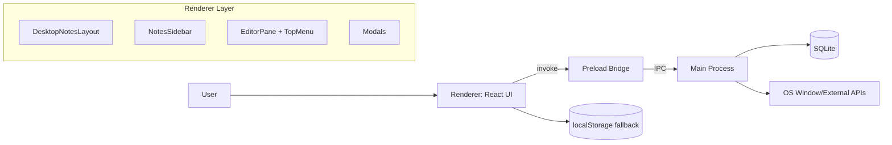
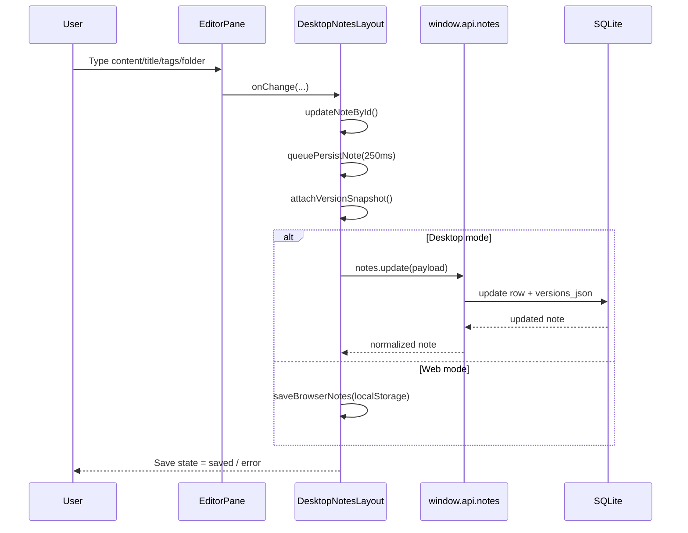
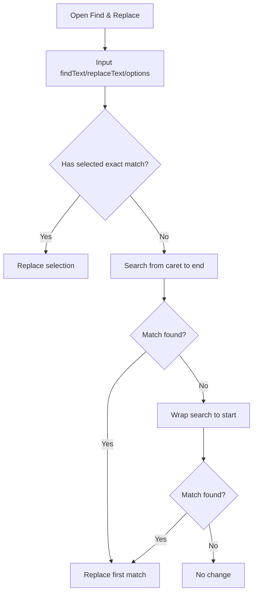
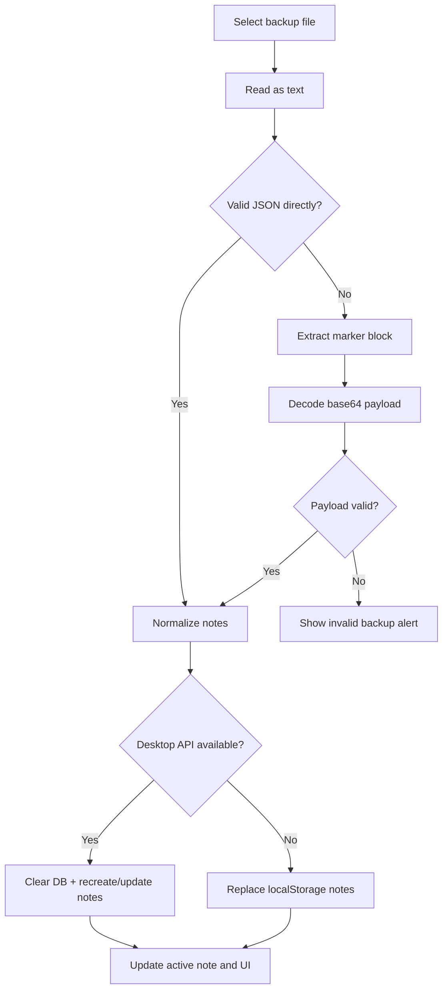
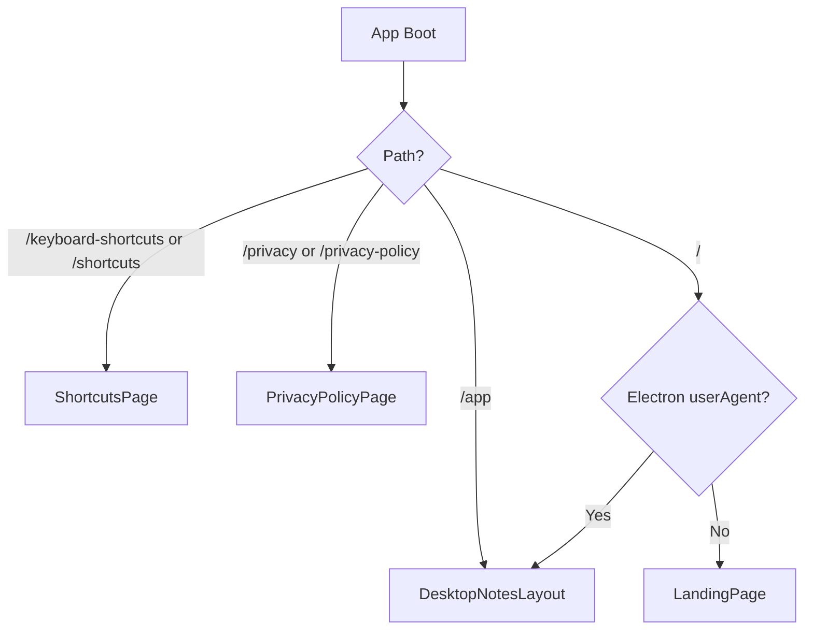
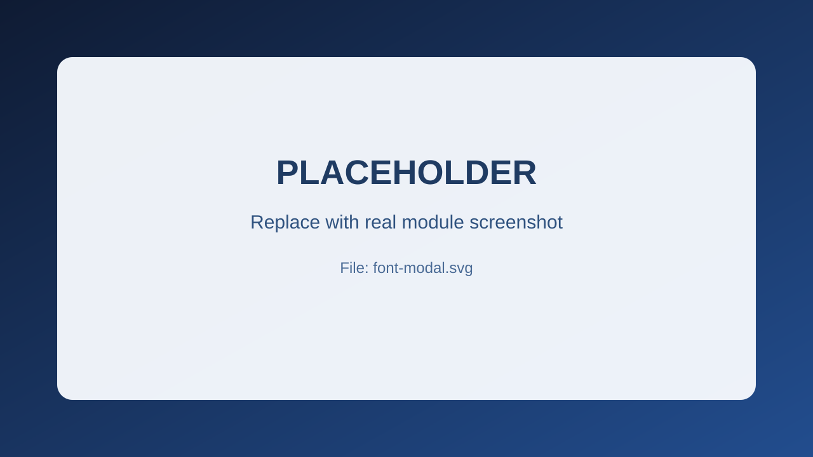

# NoteNova Studio - Project Architecture & Feature Logic

This document explains the complete architecture, module responsibilities, and feature logic of the project.
It is written for developers who want to maintain, extend, or debug the app quickly.

## 1. Project Overview

NoteNova Studio is a **hybrid Web + Desktop** note-taking application built with:

1. Electron (desktop shell)
2. React + TypeScript (UI)
3. Tailwind CSS (styling)
4. SQLite via `better-sqlite3` (desktop persistence)
5. LocalStorage fallback (web persistence)

Core capabilities include:

1. Note CRUD
2. Folder + tag organization and filtering
3. Pin/favorite and recycle bin
4. Find & replace, insert special characters/emojis/date-time
5. Autosave with save-state UI
6. Version history + restore
7. Markdown split preview
8. Export/print/backup + import
9. Desktop window controls + spellcheck + external help links
10. Command palette and keyboard shortcuts

## 2. Architecture Pattern

The app follows a layered pattern:

1. **Main Process (Electron backend)**: native window control, SQLite database, IPC handlers.
2. **Preload Bridge**: safe, typed API surface from renderer to main.
3. **Renderer (React frontend)**: state orchestration, UI, and user interactions.

Design style inside renderer:

1. `DesktopNotesLayout` is the orchestration container (state + business logic).
2. Child components (`EditorPane`, `NotesSidebar`, modals) are mostly presentation + focused interaction handlers.
3. Shared UI atoms (`IconButton`) and reusable modals are modularized.

## 2.1 Design Patterns Used

The project uses multiple practical patterns together:

1. **Layered Architecture**
   - Main, Preload, Renderer responsibilities are separated.
2. **Bridge Pattern (Electron preload bridge)**
   - Renderer never accesses Node/Electron directly; it uses `window.api` contracts.
3. **Container-Presentation Split**
   - `DesktopNotesLayout` handles state and orchestration.
   - Sidebar/editor/modals stay mostly UI-driven with explicit props.
4. **Strategy/Fallback Pattern**
   - Persistence strategy switches based on environment:
     - Desktop -> SQLite via IPC
     - Web -> localStorage
5. **Command Pattern (UI actions)**
   - Menus and command palette dispatch action callbacks.
6. **Soft-Delete Pattern**
   - Recycle bin behavior using `isDeleted` + `deletedAt`.
7. **Snapshot Versioning Pattern**
   - Autosave pipeline attaches version snapshots with dedupe and interval guards.
8. **Declarative State Machine (Save Status)**
   - Save lifecycle uses `saving | saved | error`.

## 2.2 High-Level Architecture Diagram



## 3. Runtime Layers & Data Flow

## 3.1 Main Process

Main entry: `src/main/index.ts`

Responsibilities:

1. Registers IPC modules:
   - `registerNotesIpcHandlers`
   - `registerWindowIpcHandlers`
2. Creates and configures the Electron window.
3. Applies platform-specific settings:
   - Linux WM class + desktop entry
   - macOS dock icon
4. Handles Electron app lifecycle (`whenReady`, `activate`, `window-all-closed`).

Window creation logic: `src/main/window/main-window.ts`

Key rules:

1. **DevTools auto-open only in development**
   - `isDevelopment = !app.isPackaged && is.dev`
2. **Production blocks devtools**
   - `webPreferences.devTools = false`
   - blocks `F12` and `Ctrl/Cmd + Shift + I`
3. Loads renderer:
   - Dev: `ELECTRON_RENDERER_URL`
   - Prod: bundled `index.html`

Window IPC: `src/main/ipc/window-ipc.ts`

Channels:

1. `window:toggle-maximize`
2. `window:is-maximized`
3. `window:toggle-full-screen`
4. `window:is-full-screen`
5. `window:set-spell-check-enabled`
6. `window:is-spell-check-enabled`
7. `window:open-external` (only `http/https`)

## 3.2 Notes Data Layer (Desktop)

IPC registration: `src/main/ipc/notes-ipc.ts`

Channels:

1. `notes:list`
2. `notes:create`
3. `notes:update`
4. `notes:delete`
5. `notes:clear`
6. `notes:backup`

Database module: `src/main/notes/notes-database.ts`

DB file location:

1. `app.getPath('userData')/notes.sqlite3`

Schema (table: `notes`):

1. `id`
2. `title`
3. `excerpt`
4. `content`
5. `relative_time`
6. `created_at`
7. `updated_at`
8. `folder`
9. `tags_json`
10. `is_pinned`
11. `is_deleted`
12. `deleted_at`
13. `versions_json`

Important behavior:

1. Migration-safe startup with `ALTER TABLE IF NOT EXISTS` style checks.
2. Tag and version arrays are stored as JSON text.
3. Update path sanitizes/normalizes input and limits versions to 50.

Backup module: `src/main/notes/notes-backup.ts`

1. Creates `Documents/OnlineNotes/backups/backup.zip`
2. Exports each note as a `.txt` file entry inside `backup/` folder.
3. Handles duplicate note titles by appending numeric suffixes.

ZIP generation: `src/main/notes/zip-utils.ts`

1. In-house ZIP creation (CRC32 + DOS time + local headers + central directory).
2. No external zip dependency for backup packaging.

## 3.3 Preload Bridge

Files:

1. `src/preload/index.ts`
2. `src/preload/index.d.ts`

Responsibilities:

1. Exposes safe `window.api.notes.*` methods (IPC invoke).
2. Exposes `window.electron` via electron-toolkit preload bridge.
3. Keeps type-safe contracts between renderer and main.

## 3.4 Renderer

Entry: `src/renderer/src/main.tsx`

Root app/router: `src/renderer/src/App.tsx`

Routing strategy:

1. Reads both `pathname` and `hash` route.
2. Routes:
   - `/` -> landing page (web)
   - `/app` -> full note application
   - `/keyboard-shortcuts` and `/shortcuts` -> shortcuts page
   - `/privacy` and `/privacy-policy` -> privacy page
3. Desktop special rule:
   - if user agent is Electron and route is `/`, render app directly.

SEO rule:

1. On web mode, updates `<title>` and `<meta name="description">` per route.

## 4. Source Module Map

## 4.1 Main Process Modules

1. `src/main/index.ts`
   - app boot + register IPC + create window
2. `src/main/config/app-config.ts`
   - app/window constants
3. `src/main/window/main-window.ts`
   - BrowserWindow config + devtools policy + platform icon behavior
4. `src/main/ipc/window-ipc.ts`
   - window control IPC API
5. `src/main/ipc/notes-ipc.ts`
   - notes CRUD IPC API
6. `src/main/notes/notes-database.ts`
   - SQLite persistence and migration logic
7. `src/main/notes/notes-backup.ts`
   - desktop ZIP backup
8. `src/main/notes/zip-utils.ts`
   - ZIP buffer builder

## 4.2 Renderer Orchestrator

1. `src/renderer/src/components/layout/DesktopNotesLayout.tsx`
   - central state manager and feature orchestration layer

## 4.3 Major UI Modules

1. `src/renderer/src/components/layout/AppTopBar.tsx`
   - top header + sidebar toggle
2. `src/renderer/src/components/sidebar/NotesSidebar.tsx`
   - note list, filters, sorting, backup actions
3. `src/renderer/src/components/editor/EditorPane.tsx`
   - main editor, shortcuts, text operations, preview
4. `src/renderer/src/components/editor/TopMenu.tsx`
   - all app menu dropdowns and menu action dispatch
5. `src/renderer/src/components/editor/NoteTitleRow.tsx`
   - title/folder/tags + pin/delete/version controls

## 4.4 Shared/Modal Modules

1. `AboutModal`
2. `ConfirmModal`
3. `SaveAsModal`
4. `VersionHistoryModal`
5. `CommandPaletteModal`
6. `FindReplaceModal`
7. `FontSettingsModal`
8. `SpecialCharactersModal`
9. `EmojisModal`

## 4.5 Web-only static pages

1. `LandingPage`
2. `HelpPageLayout`
3. `ShortcutsPage`
4. `PrivacyPolicyPage`

## 5. Data Model & State Shape

Primary note type (see `src/renderer/src/types/ui.ts` and `src/main/types/notes.ts`):

1. `id`
2. `title`
3. `excerpt`
4. `content`
5. `relativeTime`
6. `createdAt`
7. `updatedAt`
8. `folder`
9. `tags[]`
10. `isPinned`
11. `isDeleted`
12. `deletedAt`
13. `versions[]` where version = `{ id, title, content, savedAt }`

## 6. Persistence Strategy (Desktop vs Web)

Desktop path:

1. Renderer calls `window.api.notes.*`
2. Preload forwards via IPC
3. Main process writes to SQLite

Web path fallback:

1. No IPC notes API available
2. Renderer stores notes in browser `localStorage`
3. Same normalized shape is used to keep behavior consistent

Normalization helpers in `DesktopNotesLayout`:

1. `normalizeNotes`
2. `normalizeTagList`
3. `normalizeVersions`
4. `normalizeTimestamp`

## 7. Feature Logic (Step-by-Step)

## 7.1 App Startup

1. `DesktopNotesLayout` mounts.
2. It checks desktop API availability (`getNotesApi`).
3. Loads notes from SQLite (desktop) or localStorage (web).
4. Normalizes notes.
5. Selects first active scoped note.
6. Starts periodic `timeNow` refresh for relative-time labels.

## 7.2 Note CRUD

Create:

1. Trigger from sidebar button, menu, or shortcut.
2. Desktop: `notes:create`
3. Web: local note object with generated ID
4. New note becomes active.

Update:

1. Title/content/folder/tags update local UI state first.
2. Persist is queued via `queuePersistNote` (default delay: 250ms).
3. Save state transitions: `saving` -> `saved` or `error`.

Delete behavior:

1. Soft delete: move note to trash (`isDeleted = true`, `deletedAt = now`).
2. Hard delete: permanently remove from store (`notes:delete` or local remove).

Clear behavior:

1. In normal mode: clear means move all scoped notes to trash.
2. In trash mode: clear means permanent delete all trashed notes.

## 7.3 Autosave + Save State

Implemented in `DesktopNotesLayout`:

1. `queuePersistNote` debounces updates.
2. `persistSingleNote` writes to desktop API or returns local snapshot.
3. Save label in editor status bar uses `getSavedLabel`.

States:

1. `saving`
2. `saved`
3. `error`

## 7.4 Version History

Snapshot logic:

1. Every persist runs through `attachVersionSnapshot`.
2. New snapshot skipped if:
   - previous snapshot is too recent (`minVersionSnapshotIntervalMs = 1s`)
   - title/content unchanged
3. Max 50 snapshots retained.

UI flow:

1. User clicks clock icon in `NoteTitleRow` or command palette action.
2. `VersionHistoryModal` opens with versions.
3. Restore writes selected version title+content back into active note and persists immediately.

## 7.5 Recycle Bin (Soft Delete)

1. Active notes can be moved to trash.
2. Trash view only shows deleted notes.
3. Restore brings note back (`isDeleted = false`).
4. Permanent delete is only available from trash context.

## 7.6 Pin/Favorite

1. Notes can be pinned in editor header or note cards.
2. Pinned notes appear first in sorting (outside trash).
3. Sidebar includes pinned-only filter pill.

## 7.7 Folder + Tag System

Folder logic:

1. Folder names are free text from `NoteTitleRow`.
2. Sidebar builds folder tree using `/` separators (`buildFolderTreeNodes`).
3. Filtering supports exact folder and nested path prefix.

Tag logic:

1. Tag input supports single add (`Enter`) and multi add on paste.
2. Dedupe is case-insensitive (`mergeTags`).
3. Sidebar shows tag chips and allows multi-tag filtering.
4. Filter logic uses AND matching:
   - note must contain every selected tag.

Tag stability fix:

1. `NoteTitleRow` keeps local tag buffer (`localTags`) to prevent stale merge behavior on rapid edits.

## 7.8 Search

Location:

1. Sidebar search input updates `searchQuery`.
2. `DesktopNotesLayout` filters by title/content/folder/tags.

Normalization:

1. `normalizeSearchText` lowercases and strips diacritics.
2. Search is case-insensitive and accent-insensitive.

## 7.9 Editor Core Actions

Inside `EditorPane`:

1. Undo/Redo/Cut/Copy/Delete/SelectAll run on textarea selection.
2. Copy/Delete show toast for 3s.
3. Delete does nothing when selection is empty.
4. Cut/Copy handle clipboard fallback when `execCommand` is unavailable.

## 7.10 Find & Replace

Modal:

1. `FindReplaceModal` collects:
   - `findText`
   - `replaceText`
   - `matchCase`
   - `wholeWords`

Algorithm (`handleFindReplace`):

1. Build escaped regex from `findText`.
2. Optionally wrap with word boundaries.
3. Apply case-insensitive flag unless `matchCase` enabled.
4. If current selection exactly matches pattern, replace selection.
5. Else search from caret to end; fallback wrap-around to start.
6. Replace first match only and select replaced text.

## 7.11 Insert Menu Features

Handled by `EditorPane` + modal components:

1. Date/Time insert at cursor
2. Special characters modal with grid selection
3. Emoji modal with quick selection

Insert behavior:

1. Replaces current selection or inserts at caret.
2. Restores focus/caret after update.

## 7.12 Markdown Preview

1. Toggle from View menu or command palette.
2. Split mode: left editor + right preview.
3. Markdown renderer supports:
   - headings
   - lists
   - blockquote
   - code block/inline code
   - bold/italic/strike
   - links

Security note:

1. Inline content is escaped before transformation (`escapeHtml`).

## 7.13 Themes, Font, Word Wrap, Spellcheck

Theme:

1. Light/Sepia/Dark in View menu and command palette.
2. Affects app wrapper and editor surfaces.

Font:

1. `FontSettingsModal` controls family, size, weight, style, line-height.
2. Persisted in localStorage.

Word wrap:

1. Format menu toggle controls textarea wrapping behavior.

Spellcheck:

1. Tools menu toggle.
2. On desktop, syncs via `window:set-spell-check-enabled` IPC.

## 7.14 File Operations

Open:

1. Reads `.txt/.md` file via hidden file input.
2. Derives title from file name.
3. Upserts into active note or creates note if none active.

Save:

1. Exports note content as `.txt` with sanitized filename.

Save As:

1. `SaveAsModal` prompts filename.
2. Confirms and downloads `.txt`.

Print / PDF:

1. Uses `react-to-print`.
2. Hidden print template in layout to avoid browser-page noise.
3. Includes timestamp and note title in print header.

## 7.15 Backup Export/Import

Renderer backup export (user-facing):

1. User chooses format: `json | txt | md | pdf`.
2. App serializes notes payload.
3. For txt/md/pdf, embeds base64 payload between markers:
   - `---NOTENOVA_BACKUP_BEGIN---`
   - `---NOTENOVA_BACKUP_END---`
4. Downloads backup file.

Import:

1. Reads selected file as text.
2. Attempts direct JSON parse.
3. If not JSON, extracts payload from marker block.
4. Restores notes:
   - Desktop: clear DB, recreate and update each note via API
   - Web: replace localStorage notes

Desktop native ZIP backup:

1. Sidebar action `notes:backup` (IPC) creates zip in Documents.
2. This backup path is returned from main.

## 7.16 Command Palette

Open methods:

1. `Ctrl/Cmd + K` global
2. Tools menu item

Behavior:

1. Searches title/subtitle/keywords.
2. Arrow keys navigate.
3. Enter executes selected action.

Actions include:

1. file operations
2. backup export/import
3. find/replace
4. toggles (theme, markdown, trash view, pinned filter)
5. help pages
6. version history

## 7.17 Keyboard Shortcuts

Global shortcuts in `EditorPane`:

1. `Ctrl/Cmd + N` new note
2. `Ctrl/Cmd + O` open
3. `Ctrl/Cmd + S` save
4. `Ctrl/Cmd + Shift + S` save as
5. `Ctrl/Cmd + P` print
6. `Ctrl/Cmd + K` command palette

Editor-focused shortcuts:

1. `Ctrl/Cmd + Z` undo
2. `Ctrl/Cmd + Y` redo
3. `Ctrl/Cmd + X` cut
4. `Ctrl/Cmd + C` copy
5. `Ctrl/Cmd + A` select all

Feature shortcuts:

1. `Ctrl/Cmd + Shift + R` find & replace
2. `Ctrl/Cmd + Shift + D` insert date/time
3. `Ctrl/Cmd + Shift + C` characters
4. `Ctrl/Cmd + Shift + E` emojis
5. `Ctrl/Cmd + Shift + G` font settings
6. `Ctrl/Cmd + Shift + F` fullscreen

## 7.18 Help Menu + Routing Behavior

Help menu items:

1. Shortcuts
2. Privacy Policy
3. About

Behavior:

1. About always opens modal.
2. Shortcuts/Privacy:
   - Desktop -> route inside app hash (`#/keyboard-shortcuts`, `#/privacy`)
   - Web -> opens proper URL/new tab logic.

`HelpPageLayout` includes unified header and custom back behavior for:

1. hash routing (`#/app`)
2. browser history fallback
3. hard fallback to `/app`

## 8. Landing & Static Web Pages

Landing (`/`):

1. Professional hero + CTA
2. Live iframe preview of `/app`
3. Overview, workflow, compatibility sections
4. Desktop download buttons are environment-aware:
   - Development: local files (`/downloads/notenova-windows.exe`, `/downloads/notenova-linux.deb`, `/downloads/notenova-macos.dmg`)
   - Production: release assets (`/releases/latest/download/...`) by default
   - Optional overrides: `VITE_DOWNLOAD_WINDOWS_URL`, `VITE_DOWNLOAD_LINUX_URL`, `VITE_DOWNLOAD_MACOS_URL`
5. Footer links to app/shortcuts/privacy

Shortcuts page:

1. Structured sections with key chips.

Privacy page:

1. Policy content using shared `HelpPageLayout`.

## 9. Desktop vs Browser Behavior Matrix

1. **Storage**
   - Desktop: SQLite
   - Web: localStorage
2. **Window controls**
   - Desktop: IPC (`toggle-full-screen`, spellcheck, external open)
   - Web: not available
3. **Help navigation**
   - Desktop: internal hash route + controlled external URL strategy
   - Web: browser URL/new tab
4. **DevTools**
   - Development desktop: enabled + auto-open
   - Production desktop: disabled and shortcut-blocked

## 10. Build & Packaging Notes

Tooling:

1. `electron-vite` for build pipeline
2. `electron-builder` for distributables

Typical scripts:

1. `npm run dev` -> dev app
2. `npm run build` -> compile output
3. `npm run build:linux|build:win|build:mac` -> installable artifacts

Important output directories:

1. `out/` -> compiled runtime code (main/preload/renderer)
2. `dist/` -> packaged artifacts (`.AppImage`, `.deb`, `.snap`, etc.)

Netlify web deployment:

1. `netlify.toml` uses:
   - `command = "npm run build"`
   - `publish = "out/renderer"`
2. SPA redirects are defined for:
   - `/app`
   - `/keyboard-shortcuts` / `/shortcuts`
   - `/privacy` / `/privacy-policy`
   - catch-all fallback to `/index.html`

## 11. Extension Guide (Where to Add New Features)

If feature is UI-only and uses existing note state:

1. Add state/handlers in `DesktopNotesLayout`.
2. Pass props into relevant child component.
3. Keep child component focused on UI and event capture.

If feature needs desktop native capability:

1. Add new IPC handler in `src/main/ipc/*`.
2. Add secure preload bridge method in `src/preload/index.ts`.
3. Use it from renderer with graceful fallback.

If feature needs note schema changes:

1. Update note types (`src/main/types/notes.ts`, `src/renderer/src/types/ui.ts`).
2. Update migration logic in `notes-database.ts`.
3. Extend normalize helpers in renderer.

## 12. Practical Debug Checklist

If note updates are not saving:

1. Check `saveState` in status bar.
2. Verify `queuePersistNote` path and API availability.
3. Inspect IPC channel `notes:update`.

If desktop-only feature fails in browser:

1. Confirm guard condition around `window.electron`/`window.api`.
2. Ensure local fallback path is implemented.

If filters behave unexpectedly:

1. Review `filteredNotes` in `DesktopNotesLayout`.
2. Verify current `isTrashView`, `selectedFolder`, `selectedTags`, `isPinnedOnly`.

If tags look wrong:

1. Check `NoteTitleRow` local tag state and dedupe logic.
2. Check sidebar tag chips (display-only count moved to tooltip).

## 13. User Value Mapping (What This Serves for Users)

This section explains each major feature from user-impact perspective.

1. **Fast capture and editing**
   - Menus + keyboard shortcuts reduce friction for daily note writing.
2. **Reliable organization**
   - Folders, tags, pinning, and filters keep large note collections manageable.
3. **Data safety**
   - Autosave state, version history, and recycle bin reduce accidental data loss.
4. **Portability**
   - Export and backup/import support migration and multi-device handoff.
5. **Professional output**
   - Print/PDF layout provides clean document output.
6. **Accessibility and comfort**
   - Spellcheck, word wrap, themes, and font settings support long writing sessions.
7. **Power-user speed**
   - Command palette and shortcuts provide pro-level workflow.

## 14. Workflow Diagrams (Step-by-Step)

## 14.1 Note Save & Version Pipeline



## 14.2 Find & Replace Flow



## 14.3 Backup Import Flow



## 14.4 Route Decision Flow



## 15. Module Functionality Reference (Detailed)

## 15.1 Main & Native Layer

1. `src/main/index.ts`
   - Bootstraps app lifecycle.
   - Registers notes/window IPC handlers.
   - Creates main window and platform setup.
2. `src/main/window/main-window.ts`
   - BrowserWindow config and security-like runtime controls.
   - DevTools policy:
     - dev: enabled and optionally auto-open
     - production: disabled + blocked shortcuts
3. `src/main/ipc/window-ipc.ts`
   - Implements fullscreen/maximize/spellcheck/external URL behavior.
4. `src/main/ipc/notes-ipc.ts`
   - Bridges renderer calls to DB operations.
5. `src/main/notes/notes-database.ts`
   - SQL schema, migration checks, CRUD queries, normalization parsing.
6. `src/main/notes/notes-backup.ts`
   - Builds ZIP backup in user documents.

## 15.2 Preload Layer

1. `src/preload/index.ts`
   - Exposes typed methods for notes and electron APIs.
2. `src/preload/index.d.ts`
   - Declares `window.api` and `window.electron` contracts for TS safety.

## 15.3 Orchestration Layer

1. `src/renderer/src/components/layout/DesktopNotesLayout.tsx`
   - Single source of truth for notes and UI states.
   - Orchestrates:
     - loading
     - filtering
     - sorting
     - persistence
     - backup/import
     - print
     - command palette actions
     - modal state

## 15.4 Sidebar & Navigation Modules

1. `AppTopBar`
   - Branded header + sidebar open/close toggle.
2. `NotesSidebar`
   - Create button
   - notes/trash switch
   - search input
   - folder tree
   - tag filters
   - sort/view/action menus
   - note card action controls

## 15.5 Editor Modules

1. `TopMenu`
   - File/Edit/Insert/Format/Tools/View/Help menus.
2. `EditorPane`
   - textarea editing
   - markdown preview
   - text command actions
   - find/replace engine
   - action toast
   - editor shortcuts
3. `NoteTitleRow`
   - note title, folder input, tags input/chips, pin, delete, version history
   - tag dedupe and local synchronization

## 15.6 Modal Modules

1. `FindReplaceModal`
2. `SpecialCharactersModal`
3. `EmojisModal`
4. `FontSettingsModal`
5. `SaveAsModal`
6. `ConfirmModal`
7. `VersionHistoryModal`
8. `CommandPaletteModal`
9. `AboutModal`

Each modal follows same interaction pattern:

1. open/close state from parent
2. Esc key close
3. click outside close
4. callback on confirm/insert/restore

## 15.7 Static Web Pages

1. `LandingPage`
   - product positioning + CTA + app preview.
2. `HelpPageLayout`
   - shared top bar + back behavior.
3. `ShortcutsPage`
   - grouped keyboard reference table.
4. `PrivacyPolicyPage`
   - policy content for web/desktop help route.

## 16. Diagram + Screenshot Catalog

The following image slots are included for module/functionality documentation.
Current files are placeholders; replace with real screenshots from the running app when needed.

1. `docs/images/architecture-overview.svg`
2. `docs/images/runtime-data-flow.svg`
3. `docs/images/desktop-layout.svg`
4. `docs/images/sidebar-module.svg`
5. `docs/images/editor-pane-module.svg`
6. `docs/images/top-menu-module.svg`
7. `docs/images/note-title-row-module.svg`
8. `docs/images/find-replace-modal.svg`
9. `docs/images/special-characters-modal.svg`
10. `docs/images/emojis-modal.svg`
11. `docs/images/font-modal.svg`
12. `docs/images/save-as-modal.svg`
13. `docs/images/about-modal.svg`
14. `docs/images/version-history-modal.svg`
15. `docs/images/command-palette-modal.svg`
16. `docs/images/landing-page.svg`
17. `docs/images/shortcuts-page.svg`
18. `docs/images/privacy-page.svg`
19. `docs/images/trash-flow.svg`
20. `docs/images/backup-flow.svg`

Sample embedding in markdown:

```md

```

## 16.1 Module Screenshot Gallery

Replace these placeholders with actual screenshots from running app:

1. Architecture Overview  


2. Runtime Data Flow  


3. Desktop Layout  


4. Sidebar Module  


5. Editor Pane Module  


6. Top Menu Module  


7. Note Title Row Module  


8. Find & Replace Modal  


9. Special Characters Modal  


10. Emojis Modal  


11. Font Modal  


12. Save As Modal  


13. About Modal  


14. Version History Modal  


15. Command Palette Modal  


16. Landing Page  


17. Shortcuts Page  


18. Privacy Page  


19. Trash Flow  


20. Backup Flow  


---

This document should be updated whenever:

1. New IPC channel is added
2. Note schema changes
3. Route map or major feature flow changes
4. Any editor keyboard shortcut mapping changes

Documentation sync rule for every feature/change:

1. Update `docs/docs.md` with module/logic/architecture impact.
2. Update `README.md` if run/build/test or developer workflow changes.
3. Keep code and documentation in the same commit when possible.
